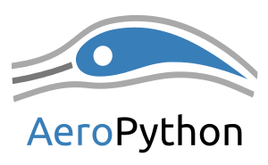

# Curso AeroPython



__Curso de Python orientado a la ingeniería__

__Si acabas de llegar__, no tienes instalado Python o no conoces el Notebook de IPython te recomendamos que leas [esta introducción](https://nbviewer.jupyter.org/github/AeroPython/Curso_AeroPython/blob/master/notebooks_completos/000-Bienvenido.ipynb). En ella aprenderás cómo descargar y utilizar el material del curso.

También puedes probar a ejecutar los notebooks online desde tu navegador (¡sin instalar nada!):

[Notebooks interactivos online:  ](http://mybinder.org/repo/AeroPython/Curso_AeroPython)

(esto es una versión demo y en fase beta, no utilices esta opción para guardar tu trabajo)

__Si sólo quieres echar un vistazo__, puedes visualizar los notebooks de cada clase en:
http://nbviewer.jupyter.org/github/AeroPython/Curso_AeroPython/tree/master/notebooks_completos/


## Autores/Colaboradores:
* [Juan Luis Cano](https://es.linkedin.com/in/juanluiscanor)  
* [Álex Sáez](https://www.linkedin.com/in/alejandrosaezm) 


* [Jesús Martos](https://es.linkedin.com/in/jesús-martos-carrizo-a3643810b)
* [Siro Moreno](https://es.linkedin.com/in/siro-moreno-martin)
* [José Luis Cercós](https://www.linkedin.com/in/jose-luis-cercos-pita-732243175)
* [Mabel Delgado](https://www.linkedin.com/in/mabeldelgadob)


## Ediciones:
__[Primera edición](http://blogs.upm.es/softwarelibre/2014/07/14/curso-de-python-en-la-upm-una-oportunidad-para-el-software-libre/):__ marzo 2014 (tag v1.0)

__Segunda edición:__ octubre 2014

__Tercera edición:__ abril de 2015

__Cuarta edición:__ marzo de 2018

__Quinta edición:__ noviembre de 2018


## Sigue aprendiendo

### Cursos
* [ES] Curso de Python para científicos e ingenieros

<a href="http://cacheme.org/curso-online-python-cientifico-ingenieros/" target="_blank"></a>

* [ES] [Recursos para aprender Python](http://www.python.org.ar/aprendiendo-python/)
* [EN] **[Software-Carpentry](https://software-carpentry.org/lessons/): Talleres de Python, Linux, SQL, GitHub (EN)**
* [EN] [A gallery of interesting Jupyter and IPython Notebooks](https://github.com/jupyter/jupyter/wiki/A-gallery-of-interesting-Jupyter-and-IPython-Notebooks)
* [EN] [Python tutor](http://pythontutor.com/)
 

### Libros gratuitos
* [EN] [Python Data Science Handbook](https://github.com/jakevdp/PythonDataScienceHandbook#python-data-science-handbook)
* [EN] [A Whirlwind Tour of Python](http://www.oreilly.com/programming/free/a-whirlwind-tour-of-python.csp)
* [EN] [Automate the Boring Stuff with Python](https://automatetheboringstuff.com/) 


### Links

* Project Euler: problemas de algoritmia: https://projecteuler.net/


* Punto flotante: 
  - cosas básicas: https://floating-point-gui.de/formats/fp/
  - guía larga y detallada: https://docs.oracle.com/cd/E19957-01/806-3568/ncg_goldberg.html
  

* Generar documentación a partir de código:
  - Sphinx guía rápida: http://www.sphinx-doc.org/es/stable/tutorial.html
  - Ejemplo en un proyecto aeropython: https://github.com/AeroPython/PyFME/wiki/C%C3%B3mo-crear-documentaci%C3%B3n-con-Sphinx-y-Read-the-Docs
  

* Dashboards:
  - Charla 20 min sobre dashboards: [Deploying Interactive Jupyter Dashboards for Visualizing Hundreds of Millions of Datapoints, in 30 L ](https://www.youtube.com/watch?v=8Jktm-Imt-I) Interesante porque además **usa `dask` (pandas fuera de memoria)** y `numba` (acelerar código) y otras librerías de representación que no hemos visto.
  - Documentación (https://jupyter-dashboards-layout.readthedocs.io/en/latest/using.html)
  - Plotly https://plot.ly/dashboards-and-reports/
  

* Dask
  - NY Taxi - Mathew Rocklin http://matthewrocklin.com/blog/work/2017/01/12/dask-dataframes
  - Docuentación http://dask.pydata.org/en/latest/examples-tutorials.html
  

* Jupyter Hub:
  - http://jupyter.org/hub
  
  
* SQL:
  - https://www.w3schools.com/sql/sql_intro.asp
  - http://swcarpentry.github.io/sql-novice-survey/
  
  
* PyInstaller:
  - Creando ejecutables autocontenidos: https://pyinstaller.readthedocs.io/en/stable/usage.html
  

## ¿Dónde pedir ayuda?
* [ES] [StackOverflow](http://es.stackoverflow.com)
* [ES] [GitHub, pidiendo ayuda a los desarroladores](https://www.youtube.com/watch?list=PLGBbVX_WvN7as_DnOGcpkSsUyXB1G_wqb&v=fm9hIZ-nUPI)


## Webs interesantes
* [Python Software Foundation](https://www.python.org/)
* [Pybonacci](http://www.pybonacci.org/)


## Comunidades interesantes y/o cercanas
* [Python España](https://www.es.python.org/)
* [AeroPython](https://github.com/AeroPython)
* [Python Madrid](https://www.meetup.com/es-ES/python-madrid/?_cookie-check=bOF3wrlXvQOFapMn)
* [PyLadies Madrid](https://www.meetup.com/PyLadiesMadrid/),
* [Otras comunidades](https://www.es.python.org/pages/comunidades.html)"


## Pythonistas relevantes en Twitter

[Lista](https://twitter.com/AeroPython/lists/relevant-pythonistas")

## Grupos de Telegram
* Python España
* Python Alicante
* Python Científico
* AeroPython

## Descargas e instalación

En los siguientes links se pueden obtener las versiones de los programas usados durante el curso.

* Anaconda3. (https://www.anaconda.com/download/)
* pycharm-community (https://www.jetbrains.com/pycharm/download/#section=windows)


## Algunos cambios en la configuración

* Cambiar la carpeta en la que arranca el notebook:


```

> jupyter notebook --generate-config

```


    En C:\Users\username\.jupyter\jupyter_notebook_config cambiar el atributo
```python
#c.NotebookApp.notebook_dir = ''

```

    por
```python
python
c.NotebookApp.notebook_dir = r'C:\new_path\folder'

```
    No olvidar la `r` delante de las comillas


* Activar IPython widgets en Jupyter Lab:


```

> conda install nodejs
> jupyter labextension install @jupyter-widgets/jupyterlab-manager

```

* Activar matplotlib widgets

```
conda install -c conda-forge ipympl
# If using the Notebook
conda install -c conda-forge widgetsnbextension
# If using JupyterLab
conda install nodejs
jupyter labextension install @jupyter-widgets/jupyterlab-manager
jupyter labextension install jupyter-matplotlib
```


<a rel="license" href="http://creativecommons.org/licenses/by/4.0/deed.es"></a><br /><span xmlns:dct="http://purl.org/dc/terms/" property="dct:title">Curso AeroPython</span> por <span xmlns:cc="http://creativecommons.org/ns#" property="cc:attributionName">Juan Luis Cano Rodriguez y Alejandro Sáez Mollejo</span> se distribuye bajo una <a rel="license" href="http://creativecommons.org/licenses/by/4.0/deed.es">Licencia Creative Commons Atribución 4.0 Internacional</a>.
