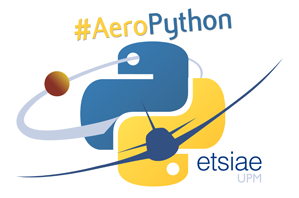

# Curso AeroPython ETSIAE

## [Juan Luis Cano](http://es.linkedin.com/in/juanluiscanor) ([@Pybonacci](https://twitter.com/Pybonacci)) y [Álex Sáez](https://www.linkedin.com/in/alejandrosaezm) ([@Alex__S12](https://twitter.com/Alex__S12))

__Curso de iniciación a Python celebrado en la Escuela Técnica Superior de Ingeniería Aeronáutica y del Espacio (Universidad Politécnica de Madrid)__

__Si acabas de llegar__, no tienes instalado Python o no conoces el Notebook de IPython te recomendamos que leas [esta introducción](http://nbviewer.ipython.org/github/AeroPython/Curso_AeroPython/blob/master/Notebooks/Clase0_Bienvenido.ipynb). En ella aprenderás cómo descargar y utilizar el material del curso.

__Si sólo quieres echar un vistazo__, puedes visualizar los notebooks de cada clase en:
http://nbviewer.ipython.org/github/AeroPython/Curso_AeroPython/tree/master/Notebooks/

__[Primera edición](http://blogs.upm.es/softwarelibre/2014/07/14/curso-de-python-en-la-upm-una-oportunidad-para-el-software-libre/):__ Marzo 2014 (tag v1.0)

__Segunda edición:__ Octubre 2014 (el material se encontrará en constante evolución durante todo el mes)

 Curso AeroPython por Juan Luis Cano Rodriguez y Alejandro Sáez Mollejo se distribuye bajo una <a rel="license" href="http://creativecommons.org/licenses/by/4.0/deed.es">Licencia Creative Commons Atribución 4.0 Internacional</a>.
