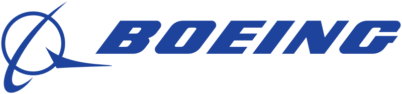

# Curso AeroPython

## [Juan Luis Cano](http://es.linkedin.com/in/juanluiscanor) y [Álex Sáez](https://www.linkedin.com/in/alejandrosaezm)

__Curso de Python orientado a la ingeniería__

__Si acabas de llegar__, no tienes instalado Python o no conoces el Notebook de IPython te recomendamos que leas [esta introducción](http://nbviewer.jupyter.org/github/AeroPython/Curso_AeroPython/blob/master/notebooks_completos/Clase0_Bienvenido.ipynb). En ella aprenderás cómo descargar y utilizar el material del curso.

__Si sólo quieres echar un vistazo__, puedes visualizar los notebooks de cada clase en:
http://nbviewer.jupyter.org/github/AeroPython/Curso_AeroPython/tree/2016-12-boeing/notebooks_completos/

 Curso AeroPython por Juan Luis Cano Rodriguez y Alejandro Sáez Mollejo se distribuye bajo una <a rel="license" href="http://creativecommons.org/licenses/by/4.0/deed.es">Licencia Creative Commons Atribución 4.0 Internacional</a>.
